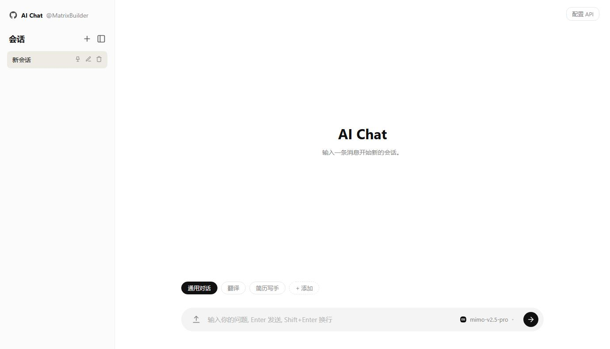

# 一个简单的 AI 聊天 HTML

这是一个简单的 AI 聊天 HTML 页面，纯前端单文件，打开即用。注：只支持 OpenAI 格式的 API。

兼容 OpenAI Chat Completions API 格式，支持多模型切换、流式输出和 Markdown 渲染。

## 快速开始

1. 在浏览器中打开 `index.html`
2. 点击右上角 **配置 API**，填入 API URL 和 API Key
3. 开始对话

## 默认配置

| 项目 | 值 |
|------|-----|
| API URL | `https://token-plan-cn.xiaomimimo.com/v1` |
| 默认模型 | `mimo-v2.5-pro` |

## 操作

| 操作 | 说明 |
|------|------|
| `Enter` | 发送消息 |
| `Shift + Enter` | 换行 |
| 左键点击预设标签 | 切换参数预设 |
| 右键点击预设标签 | 编辑该预设 |
| 点击上传按钮 | 上传图片进行多模态对话 |

## 技术栈

- HTML + CSS + JavaScript（单文件）
- [marked.js](https://github.com/markedjs/marked) Markdown 渲染
- localStorage 数据持久化
