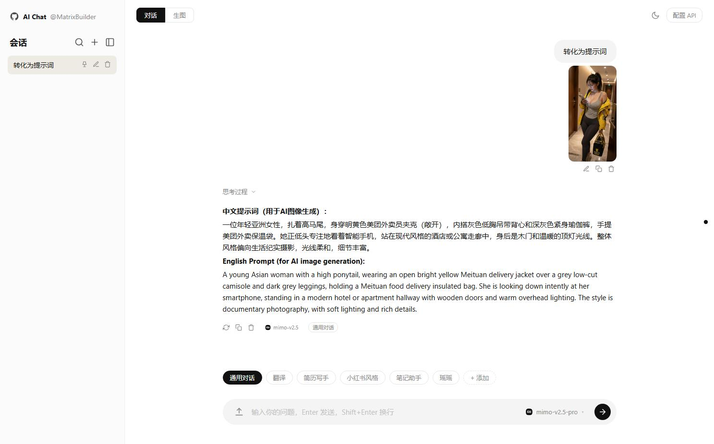
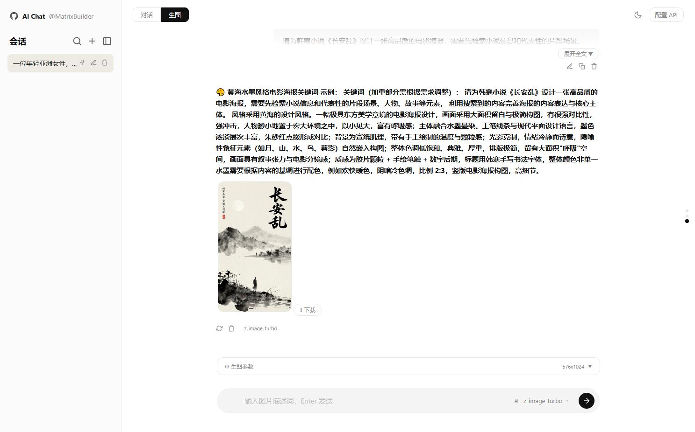
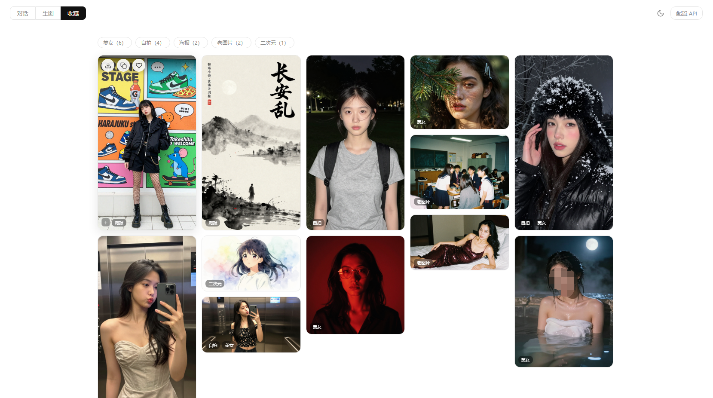

# AI Chat — 多模型对话 & 生图网页

纯前端静态应用，打开 `index.html` 即用。支持 OpenAI 格式 Chat Completions API 和 Images Generations API。

## 快速开始

1. 在浏览器中打开 `index.html`
2. 点击右上角 **配置 API**，填入 API URL 和 API Key
3. 开始对话或生图

## 默认配置

| 项目 | 值 |
|------|-----|
| API URL (对话) | `https://token-plan-cn.xiaomimimo.com/v1` |
| 默认模型 (对话) | `mimo-v2.5-pro` |
| API URL (生图) | `https://ai.gitee.com/v1` |
| 默认模型 (生图) | `z-image-turbo` |
| 免费生图 z-image API 100次/日 | [https://ai.gitee.com/serverless-api?model=z-image-turbo](https://ai.gitee.com/serverless-api?model=z-image-turbo) |

## 对话模式

| 操作 | 说明 |
|------|------|
| `Enter` | 发送消息 |
| `Shift + Enter` | 换行 |
| 左键点击预设标签 | 切换参数预设 |
| 右键点击预设标签 | 编辑该预设 |
| 点击上传按钮 | 上传图片进行多模态对话 |
| 刷新按钮 | 重新生成回复，旧回复存入版本历史 ◂ ▸ |

## 生图模式

| 操作 | 说明 |
|------|------|
| `Enter` | 发送提示词生成图片 |
| 点击图片 | 全屏灯箱预览 |
| 下载按钮 | 下载消息中全部生成图片 |
| 收藏按钮 | 收藏图片（含提示词）到收藏夹 |
| 刷新按钮 | 重新生成，旧图片存入版本历史 ◂ ▸ |
| 修改按钮 | 编辑提示词后重新生成 |
| 折叠面板 | 点击生图参数收起或展开参数 |
| 参数标签 | 消息下方显示本次生图参数摘要 |

## 收藏模式

点击顶栏 **收藏** 切换到收藏页面。瀑布流布局，一行 5 张，自适应屏幕宽度。

| 操作 | 说明 |
|------|------|
| 下载 | 下载该图片 |
| 复制 | 复制提示词到剪贴板 |
| 取消收藏 | 从收藏夹移除 |
| 点击图片 | 全屏灯箱预览 |
| `+` 按钮 | 添加标签，弹出下拉菜单可选择已有标签或输入新标签 |
| × 标签 | 鼠标悬浮标签上出现 ×，点击移除该标签 |
| 标签栏 | 顶部显示所有标签及数量（如 `自拍（1）`），点击按标签筛选 |
| ✕ 全部 | 清除标签筛选 |

### 生图参数

| 参数 | 说明 |
|------|------|
| 反向词 | 排除描述 |
| 步数 | 推理步数 1-50 |
| 种子 | 留空=随机，填值=固定（相同种子产相同图） |
| 引导强度 | 文本引导权重 0-20 |
| 图尺度 | 图像放大强度 0-1 |
| 尺寸 | 1:1 / 4:3 / 3:4 / 16:9 / 9:16 / 自定义 |
| 控制模式 | HED / Canny / Depth / Pose + 参考图上传 |

## 模型隔离

对话模式仅显示对话模型，生图模式仅显示生图模型，互不干扰。两种模式拥有独立的会话列表和会话 ID。收藏模式独立于两者，不影响对话/生图会话。

## 搜索

搜索覆盖全部会话（含对话和生图），点击结果自动切换到对应模式。

## 导入导出

配置、预设、全部会话和收藏夹（含标签）可通过 **配置 API** 弹窗的 **导出 JSON** / **导入 JSON** 完整备份和迁移。

## WebDAV 备份恢复

在 **配置 API** 弹窗中切换到 **WebDAV 备份**，填写 WebDAV 地址、用户名、密码和远程备份文件路径后，可测试连接、立即备份或从远程备份恢复。浏览器直连 WebDAV 需要服务端允许跨域请求。

如果 WebDAV 服务使用 dufs，需要启动 `--enable-cors`，或设置 `DUFS_ENABLE_CORS=true`。完整备份恢复还需要允许写入相关操作，例如 `--allow-all` 或按需开启上传、删除等权限。

## 技术栈

- HTML + CSS + JavaScript（静态模块化）
- [marked.js](https://github.com/markedjs/marked) Markdown 渲染
- IndexedDB 持久化存储（配置、会话、收藏夹）
- IntersectionObserver 图片懒加载
- CSS column 瀑布流 + 毛玻璃效果

## 友链
本项目积极参与并认可 [linux.do社区](linux.do)
